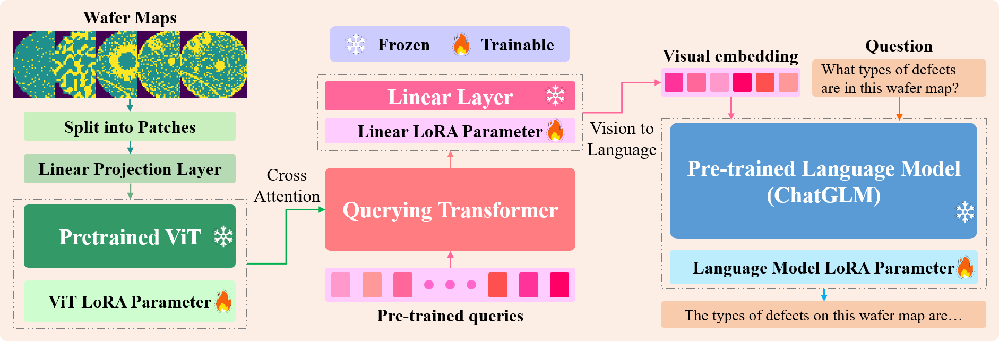

# WamGLM: A multimodal large-scale language model for wafer map defect information in-depth query through multi-turn dialogue based on prototypical supervised contrastive learning
> **Authors:** Shulong Gu, Zihao Lei, Guangrui Wen, Quanning Xu, Zhaojun Steven Li, Xuefeng Chen, Chunsheng Yang

> **Abstract:** To ensure production efficiency and process stability in semiconductor manufacturing, it is of critical importance to detect wafer map defects and perform information query for tracing and solving problems during the manufacturing process. Numerous vision models based on deep learning have been successfully applied to wafer map defect recognition (WMDR), yielding remarkable results. However, the dynamic and in-depth querying of wafer map defect information remains relatively underexplored. Leveraging the rapid advancements in multimodal large language models (MLLMs), this paper proposes a novel approach for wafer map defect information query (WMDIQ). First, following the paradigm of employing cross-modal alignment model to bridge vision and language models, an end-to-end response MLLM: general language model for wafer map (WamGLM), is constructed for WMDIQ. Concurrently, by designing an interactive dialogue framework between large language models (LLMs), the first large-scale multi-turn dialogue dataset: visual multi-turn question answering dataset for wafer map defects (WaferMapVMQA Dataset), is constructed for wafer map defect analysis. Subsequently, WamGLM is trained using a two-stage fine-tuning strategy. In the first stage, a visual fine-tuning method based on prototypical supervised contrastive learning (PSCL) is introduced to enhance the intra-class compactness and inter-class separability of defect features. In the second stage, language fine-tuning is conducted using the WaferMapVMQA Dataset to infuse specialized knowledge into WamGLM. To validate the effectiveness and superiority of the proposed method, experiments are conducted on a real wafer map dataset. The results demonstrate that the proposed method significantly outperforms other methods in both defect recognition performance and information query response performance.
<p align="center">
  
</p>

## Introduction
This repository provides the official PyTorch implementation of our paper:<br>
**"WamGLM: A multimodal large-scale language model for wafer map defect information in-depth query through multi-turn dialogue based on prototypical supervised contrastive learning"**.

> Our proposed WamGLM is based on [VisualGLM-6B](https://github.com/THUDM/VisualGLM-6B) and employs LoRA fine-tuning.

## Dataset
The dataset we used was the WaferMapVMQA dataset that we constructed ourselves. WaferMapVMQA dataset is based on the open-source dataset [MixedWM38 Dataset](https://github.com/Junliangwangdhu/WaferMap). For details, refer to the folder `finetune_data/WaferMapVMQA_Dataset_Example.json`.
## Enviroment
Pytho==`3.10`, Pytorch==`2.4.0`, CUDA==`11.8`
### Enviroment Setup
```bash
pip install -r requirements.txt
```
## Preparation
Organize the dataset folder in the same way as the `finetune_data` folder.
## Training
To avoid potential network connection issues, run the following command in advance:
```bash
export HF_ENDPOINT=https://hf-mirror.com
```
### Stage 1
To perform vision fine-tuning on our model, run the following command:
```bash
bash finetune/finetune_cepbcl_trainvisiononly.sh
```
### Stage 2
In the second stage, language fine-tuning is performed using the model weights obtained from the visual fine-tuning in the first stage. Organize the model weight folder in the same way as the original VisualGLM-6B model weight folder, and then use the environment variable `SAT_HOME` to change the model weight download path, as shown in the following command:
```bash
export SAT_HOME="/checkpoints/vision_finetune_weight"
```
To perform language fine-tuning on our model, run the following command:
```bash
bash finetune/finetune_trainchatonly.sh
```
## WebUI
```bash
python web_demo.py --from_pretrained checkpoints/language_finetune_weight
```
## Acknowledgement
We would like to thank [VisualGLM-6B](https://github.com/THUDM/VisualGLM-6B) for providing the foundational open-source multimodal large model.

We would like to thank Li et al. for their pioneering [DefectGLM](https://github.com/WH-HuanWang/Defect-GLM).

We would like to thank Wang et al. for releasing the open-source wafer map dataset [MixedWM38 Dataset](https://github.com/Junliangwangdhu/WaferMap).

We would like to thank Zhu et al. for their [Balanced Contrastive Learning](https://github.com/FlamieZhu/Balanced-Contrastive-Learning).
## Citation
If this code is useful in your research we would kindly ask you to cite our paper.
```bash
@misc{Gu2025WamGLM,
      title={WamGLM: A multimodal large-scale language model for wafer map defect information in-depth query through multi-turn dialogue based on prototypical supervised contrastive learning},
      year={2025},
      publisher = {Elseiver},
      journal = {Applied Soft Computing}
}
```
